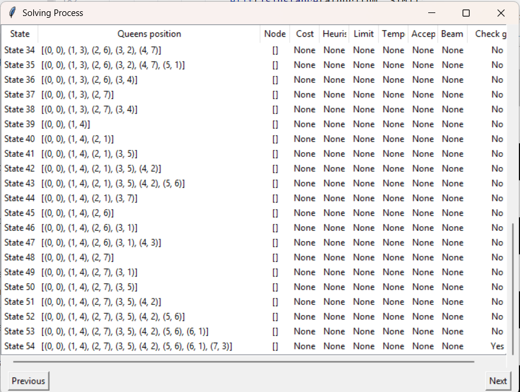

# Báo cáo bài tập AI cá nhân

## Giới thiệu
Đây là bài báo cáo bài tập cá nhân về thực hiện giải bài toán 8 con hậu với những thuật toán tìm kiếm đường đi đã được học trong học kỳ 1 năm 2025-2026.

Giảng viên hướng dẫn: Phan Thị Huyền Trang
Sinh viên thực hiện: Lưu Quang Tiến - 23110157

## Mục tiêu
Ứng dụng những nhóm thuật toán để thực hiện bài toán 8 con hậu. Từ đó tìm những thuật toán tối ưu, phù hợp nhất để giải bài toán.

## Mô tả bài toán
* Trạng thái ban đầu (Initial State): Bàn cờ 8x8 rỗng, gồm 64 ô được đánh số theo hàng và cột.
* Trạng thái mục tiêu (Goal State): Cả 8 con hậu được đặt trên bàn cờ sao cho không có con nào có thể tấn công con khác.
* Hành động (Actions): Thực hiện đặt từng con hậu vào các vị trí đảm bảo an toàn.
* Không gian trạng thái (State): Tất cả các trạng thái có thể sinh ra trong quá trình đặt con hậu.

## *Nhóm thuật toán 1*
Ở nhóm thuật toán này, bàn cờ ở bên phải là trạng thái mục tiêu được người dùng đặt sẵn.

### BFS
Thuật toán sẽ quét cạn qua không gian trạng thái cho đến khi tìm được trạng thái mục tiêu. Thứ tự những trạng thái được thực hiện là FILO (First In Last Out) trong hàng đợi.

### DFS
Thuật toán tìm kiếm theo chiều sâu bắt đầu từ trạng thái ban đầu đến trạng thái mục tiêu, Thứ tự những trạng thái được thực hiện là FIFO (First In First Out) trong hàng đợi. DFS có thể tìm kiếm đường đi nhanh hơn BFS với không gian trạng thái nhỏ hơn, nhưng nhược điểm của DFS là nó có thể bị kẹt trong vòng lặp vô tận, không thể đến trạng thái mục tiêu.

### DLS
Thuật toán tìm kiếm theo chiều sâu tương tự như DFS, nhưng khác với DFS nó được đặt limit độ sâu, ngăn thuật toán đi tìm kiếm quá sâu. Đối với bài 8 con hậu, khi limit = 8 thì DLS hoạt động giống với DFS.

### IDS
Thuật toán tìm kiếm theo chiều sâu, là cải tiến của DLS. Sau khi duyệt qua tất cả trạng thái nằm ở trong limit đặt trước, các trạng thái mới được mở rộng ra như BFS và limit được tăng lên 1. Thuật toán sẽ tìm kiếm lại với limit mới. Điều này giúp khắc phục hạn chế nguy cơ bị mắc vào vòng lặp vô hạn của DFS. Đối với bài 8 con hậu, khi limit = 8 thì IDS hoạt động giống với DFS.

## *Nhóm thuật toán 2*
Ở nhóm thuật toán này, bàn cờ ở bên phải là trạng thái mục tiêu được người dùng đặt sẵn như ở nhóm 1.

### UCS
Thuật toán UCS khác biệt với những thuật toán trước ở việc kèm theo cost g(n) cho các trạng thái và từ đó tìm đường đi với chi phí ít nhất. Ở thuật toán này, cost được tính bởi số ô mới bị tấn công bởi con hậu mới đặt.

### Greedy
Thuật toán Greedy (hay Best first search) sử dụng giá trị heuristic h(n) để tìm vị trí đặt con hậu tốt nhất tại thời điểm hiện tại, heuristic càng thấp thì độ ưu tiên càng cao. Heuristic được tính bằng khoảng cách giữa con cờ tiếp theo so với con cờ cùng dòng tại bàn cờ bên phải.

### A*
Thuật toán A* kết hợp việc sử dụng g(n) và h(n) với công thức f(n) = g(n) + h(n). Trong đó g(n) là giá trị cost từ vị trí ban đầu cho đến hiện tại và h(n) là giá trị heuristic hiện tại.

## *Nhóm thuật toán 3*

### Hill Climbing
Thuật toán leo đồi sẽ luôn lựa chọn những trạng thái có giá trị heuristic tốt nhất, không lựa chon những đường đi có giá trị thấp hơn hay bằng với vị trí hiện tại. Điều này làm Hill climbing tìm kiếm cực nhanh nhưng có hạn chế vô cùng nghiêm trọng. Hill climbing có thể bị mắc kẹt trong một vùng local, khi điều đó xảy ra thuật toán sẽ ngưng và không tìm thấy được trạng thái mục tiêu.

### Simulated annealing
Thuật toán cải tiến cho Hill Climbing bằng cách cho chấp nhận những bước đi "tệ hơn" trạng thái hiện tại qua nhiệt độ T và độ làm lạnh alpha.

### Beam search
Beam search cốt lõi cũng hoạt động tương tự như thuật toán Greedy, nhưng khác với Greedy chỉ lấy 1 lựa chọn tốt nhất, Beam search sẽ lấy số bước đi tốt nhất tại thời điểm đó tương ứng với độ rộng của beam đã được khai báo trước. K = 3

### Genetic algorithm
Thuật toán Genetic sẽ lấy 2 trạng thái bố mẹ sinh ra 2 trạng thái con có thuộc tính của 2 trạng thái bố mẹ, khi sinh ra có mức độ biến dị làm cho quần thể trạng thái phong phú hơn, tránh sự đồng hóa quần thể. mutation_prob = 0.2, giới hạn quần thể = 1000.

## *Nhóm thuật toán 4*

### Không xác định
Tìm thấy tất cả 92 trạng thái mục tiêu cho bài toán 8 con hậu từ trạng thái ban đầu [].

### Môi trường không nhìn thấy
Thuật toán sử dụng trạng thái niềm tin để tìm kiến. Trong thuật toán, không thể biết được bước đi tiếp theo ở đâu, trạng thái cuối cùng là gì. Kết quả thuật toán đưa ra là tập tất cả các trạng thái mục tiêu cho bài toán 8 con hậu.

### Môi trường nhìn thấy một phần
Thuật toán cải tiến cho thuật toán tìm kiếm trong môi trường không nhìn thấy gì hết. Trong thuật toán này sẽ cho biết vị trí con hậu đầu tiên (0, 2) và từ đó sẽ đi tìm tập các trạng thái mục tiêu cho bài toán 8 con hậu có con hậu đầu tiên là (0, 2).

## *Nhóm thuật toán 5*

### Backtracking
Thuật toán sử dụng đề quy để đi qua những trạng thái và kiểm tra rằng buộc, nếu như thỏa mãn rằng buộc thì sẽ tiếp tục xét trạng thái con tiếp theo, nếu không thì xét trạng thái khác. Đề quy đến khi tìm được đáp án cho bài toán 8 con hậu.

### Forward checking
Thuật toán Forward checking sẽ kiểm tra những vi phạm rằng buộc trong bài toán trước khi sinh ra trạng thái con và loại chúng ra khỏi domain cần kiểm tra. Sau khi loại xong, có thể sử dụng các thuật toán khác như Backtracking để tiếp tục giải.

### AC3
Thuật toán AC3 sẽ từ những rằng buộc sẽ tạo ra những "Arc" để kiểm tra những domain. Những Arc này bao gồm những rằng buộc ban đầu và kèm theo đảo ngược của những rằng buộc đó. Nếu khi kiểm tra domain, domain bị thay đổi thì ta sẽ đưa những Arc có domain bị thay đổi nằm ở bên phải vào hàng đợi Arc kiểm tra domain. Nếu trong hàng đợi đã có Arc đó rồi thì khỏi cần đưa vào. Tiếp tục cho đến khi hàng đợi rỗng. Sau khi loại xong, có thể sử dụng các thuật toán khác như Backtracking để tiếp tục giải.

## **Kết luận**
- Đối với những trường hợp đã biết được trạng thái mục tiêu như thế nào từ ban đầu thì những thuật toán ở nhóm 2, đặc biệt là A* là tối ưu nhất khi xét về không gian trạng thái.
- Đối với những trường hợp không biết được trạng thái mục tiêu như thế nào thì những thuật toán ở nhóm 5, đặc biệt là AC3 là tối ưu nhất khi xét về không gian trạng thái.
